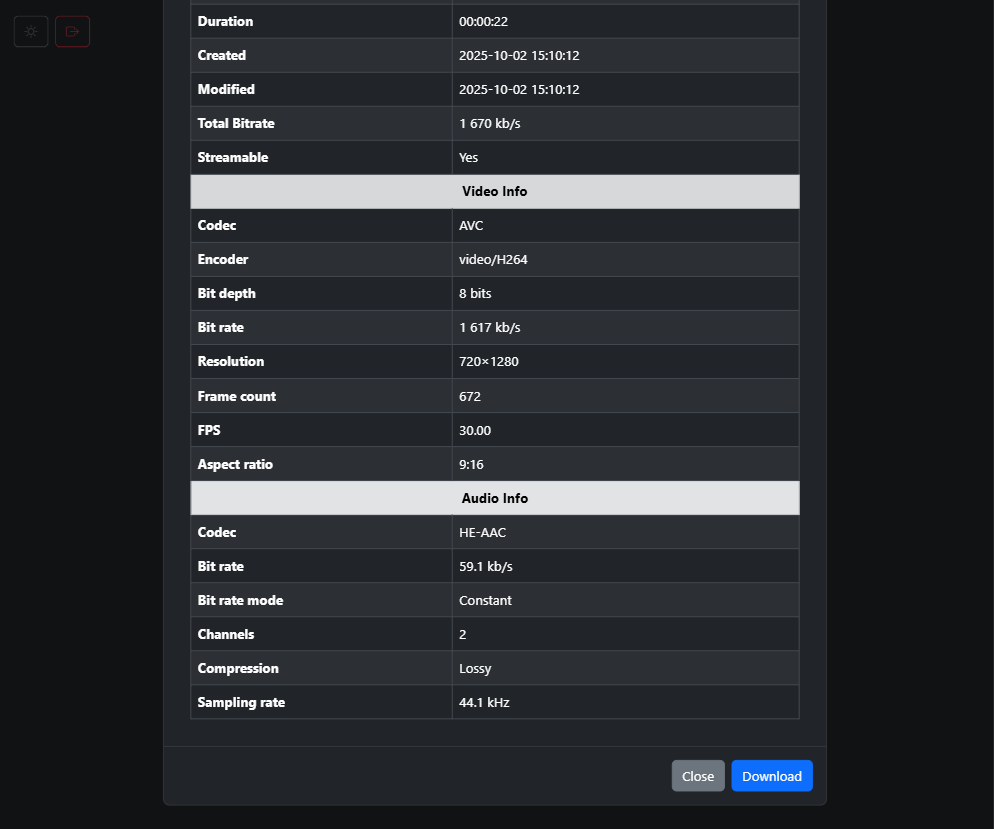

Media Library
==============================


Getting Started
------------
Clone the project from GitHub and run `mvn clean install`.

```shell
git clone https://github.com/tariqshaban/media-library
```

Java 17 needs to be installed for the project to compile as expected.

> [!IMPORTANT]
> The project depends on `vlcj-info`, which is an abstraction that binds to the native `MediaInfo` tool.
>
> `MediaInfo` must be installed to display the media's metadata. Refer
> to [MediaInfo](https://mediaarea.net/en/MediaInfo)'s official site.
>
> No action is needed on Windows since the project is already bundled with the native library.


Project Structure
------------

    ├── main
    │   ├── common                   <- Contains constants that are used often within the code.
    │   ├── component                <- Contains classes marked with @Component annotation.
    │   ├── config                   <- Contains classes marked with @Configuration annotation.
    │   ├── controller               <- Contains classes marked with @Controller/@RestController annotation.
    │   │   └── controller_advice    <- Contains classes marked with @ControllerAdvice annotation.
    │   ├── dto                      <- Contains classes that are exposed to the client side.
    │   ├── exception                <- Contains classes that extend RuntimeException.
    │   ├── mapper                   <- Contains classes marked with @Mapper annotation.
    │   ├── model                    <- Contains domain classes for internal use, may be wrapped in DTOs.
    │   ├── service                  <- Contains classes marked with @Service annotation.
    │   ├── utils                    <- Contains helper classes that are not business-related.
    │   │   └── file_validator       <- Contains file validation interface and its concrete implementations.
    │   └── resources
    │       ├── static
    │       │   ├── css              <- Contains style sheets that are served to the client side.
    │       │   ├── images           <- Contains icons and images that are served to the client side.
    │       │   └── js               <- Contains scripts that are served to the client side.
    │       ├── templates            <- Contains Thymeleaf templates that are served to the client side.
    │       └── win32-x86-64         <- Contains MediaInfo DLL file.
    └── test
        ├── component                <- Contains unit tests for classes within the component package.
        ├── service                  <- Contains unit tests for classes within the service package.
        ├── utils                    <- Contains unit tests for classes within the utils package.
        │   └── file_validator       <- Contains unit tests for classes within the file_validator package.
        └── resources                <- Contains resource files necessary to run the tests.

Usage
------------

Run the main method within `src/main/java/com/multimedia/media_library/MediaLibraryApplication.java`.

The web application is served on port [8080]((http://localhost:8080/)) by default.

The default credentials are **user1** and **user2** with a password of **P@ssw0rd!** for both users.

Uploaded media will be stored by default in `C:\media-library` (depending on
`com.multimedia.media-library.users.credentials.path` variable).


Rest Controller Validation Flow
------------


Web Application Showcase
------------

<table>
   <tr>
      <td style="text-align:center">
         <h4 style="padding: 0;">Login Screen</h4>
         
      </td>
      <td style="text-align:center">
         <h4 style="padding: 0;">Main Screen</h4>
         
      </td>
   </tr>
   <tr>
      <td style="text-align:center">
         <h4 style="padding: 0;">Details Screen</h4>
         
      </td>
      <td style="text-align:center">
         <h4 style="padding: 0;">Details Screen (bottom)</h4>
         
      </td>
   </tr>
</table>


Notes
------------

* The media type validation may not be secure enough, since it solely relies on the mimetype and file
  extension. [Magic bytes](https://en.wikipedia.org/wiki/List_of_file_signatures) can be used to verify the file's
  signature.
* For simplicity, users' credentials are stored in a hardcoded raw file within the resources instead of a database. The
  file is colon-delimited, where the first part denotes the username, while the second part denotes the bcrypt hash of
  the password. Bcrypt hashes can be generated [here](https://bcrypt-generator.com).
* Since the users' credentials are stored in local files, it is imperative to limit the scope of access and privilege
  of such a file.
* Refer to `application.properties` for adjusting parameters such as the maximum file upload size and allowed file
  extensions.
